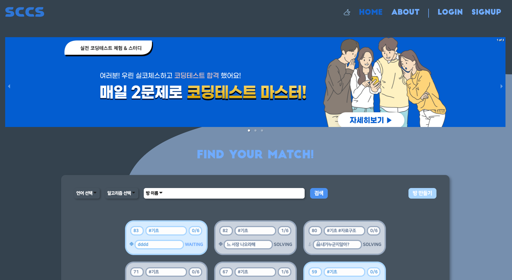
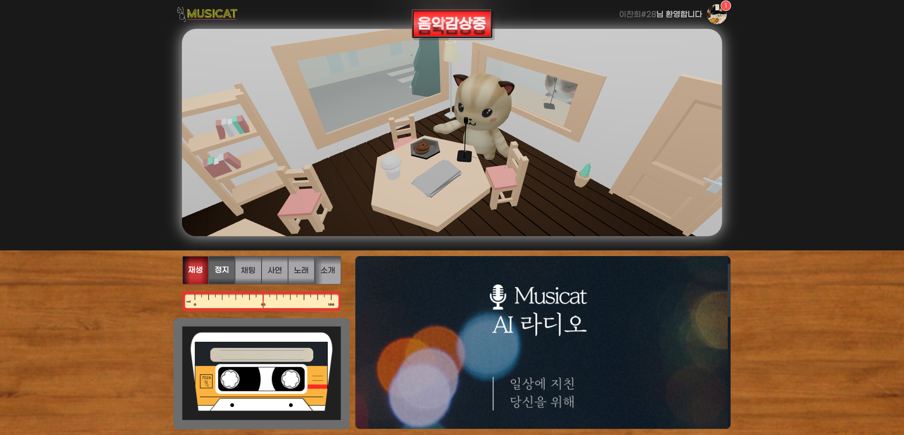
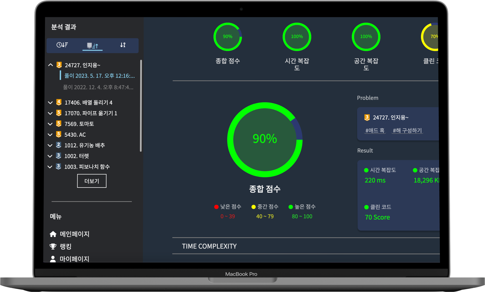

  
  
  ### 🛠️ Skill 🛠️
  

    
    
  

  

    
    
  

  

    
     
    
  

  

    

 

  
  ###  💻 Project 💻
  
  <table>
      <tr>
          <td height="140px" align="center"> <a href="">
                  SCCS </a>  </td>
          <td height="140px" align="center"> <a href="">
                  Musicat </a>  </td>
          <td height="140px" align="center"> <a href="">
                  Algopat </a>  </td>
          <td height="140px" align="center"> <a href="">
                  The Gallery </a>  </td>
      </tr>
      <tr>
          <td align="center">코딩테스트 스터디 플랫폼 </td>
          <td align="center">인공지능 라디오 </td>
          <td align="center">알고리즘 피드백 서비스 </td>
          <td align="center">3D 전시회 </td>
      </tr>
  </table>

